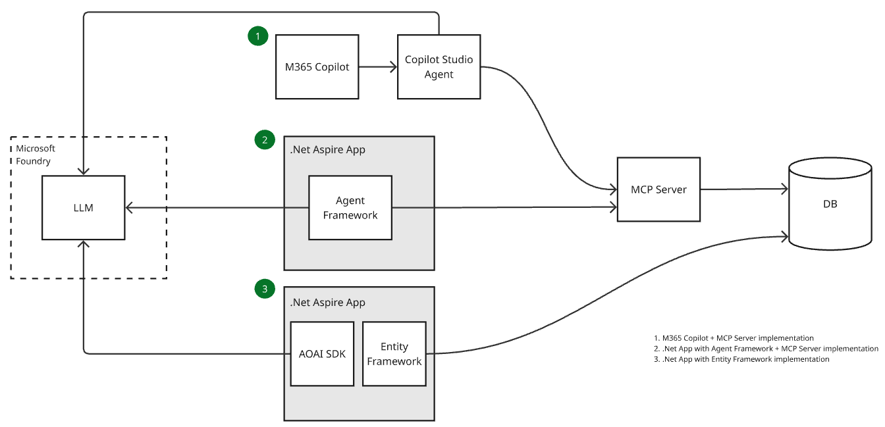

# DB-Summarisation

.NET Aspire application featuring an MCP server that exposes patient medical history from SQL Server to AI assistants like GitHub Copilot, with an Agent Framework-based API for querying medical data.

## Options
Below are a few options for achieving the goal, this repo demonstrates the Agent Framework option. Detailed comments about the Agent Framework implementation can be found in the code. 
> Note: This is a simple use case that could be achieved without the Agent Framework. I'm using it here as a demonstration.


## Prerequisites

- [VS Code](https://code.visualstudio.com/) with [Dev Containers extension](https://marketplace.visualstudio.com/items?itemName=ms-vscode-remote.remote-containers)
- [Docker Desktop](https://www.docker.com/products/docker-desktop/)

## Quick Start

### 1. Open in Dev Container

```bash
git clone https://github.com/ianlcurtis/DB-Summarisation.git
code DB-Summarisation
```

When prompted, click **"Reopen in Container"** and wait for it to build.

### 2. Create Database

```bash
/opt/mssql-tools18/bin/sqlcmd -S db -U sa -P "YourStrong@Passw0rd" -C -Q "CREATE DATABASE PatientMedicalHistory"
/opt/mssql-tools18/bin/sqlcmd -S db -U sa -P "YourStrong@Passw0rd" -C -d PatientMedicalHistory -i db/patient_medical_history_database.sql
/opt/mssql-tools18/bin/sqlcmd -S db -U sa -P "YourStrong@Passw0rd" -C -d PatientMedicalHistory -i db/patient_medical_history_data.sql
```

### 3. Use with Copilot

The MCP server is pre-configured in `.vscode/mcp.json`. Reload VS Code (`Ctrl+Shift+P` → **Developer: Reload Window**) and ask Copilot:

- "Get the medical history for patient 1"
- "Show patient 3's medications"
- "What are patient 5's lab results between 2020-01-01 and 2023-12-31?"

## Available MCP Tools

| Tool | Description |
|------|-------------|
| `GetPatientMedicalHistory` | Complete medical history for a patient |
| `GetPatientMedicalHistoryBetweenDates` | Medical history filtered by date range |

## Running the Aspire App

```bash
# Configure Azure OpenAI (one-time)
cd src/MedicalAgent.AppHost
dotnet user-secrets set "ConnectionStrings:openai" "Endpoint=https://<your-resource>.openai.azure.com/;Key=<your-key>"

# Run (from solution root)
dotnet run --project src/MedicalAgent.AppHost
```

Chat API: `POST http://localhost:5000/api/chat` with `{"message": "your query"}`

For a quick test, use [api-tests.http](src/MedicalAgent.Api/api-tests.http) in VS Code with the REST Client extension.

## Running MCP Server Only

```bash
cd src/MedicalDbMcpServer
dotnet run
```

HTTP transport available at `http://localhost:8080/mcp`.

## License

See [LICENSE](LICENSE) for details.