# MedicalDbMcpServer

## Overview

**MedicalDbMcpServer** is a .NET 8 application that implements a [Model Context Protocol (MCP)](https://modelcontextprotocol.io/) server. Its purpose is to expose patient medical history data from a SQL Server database to AI assistants (such as GitHub Copilot) through a standardized protocol.

In simple terms, this server acts as a **bridge** between an AI assistant and a medical database, allowing the AI to safely query patient information using well-defined tools.

The server uses **HTTP/SSE transport**, making it suitable for both local development and cloud deployment (e.g., Azure Container Apps).

```mermaid
flowchart LR
    AI[🤖 AI Assistant<br/>e.g. GitHub Copilot]
    MCP[📡 MedicalDbMcpServer<br/>MCP Server]
    DB[(🗄️ SQL Server<br/>PatientMedicalHistory)]
    
    AI <-->|MCP Protocol<br/>via HTTP/SSE| MCP
    MCP <-->|SQL Queries| DB
```



### What is MCP?

The **Model Context Protocol (MCP)** is a standard that enables AI assistants to interact with external tools and data sources. Instead of the AI having direct database access, it communicates with an MCP server that:

1. **Exposes tools** - Predefined operations the AI can invoke
2. **Handles requests** - Receives tool invocation requests from the AI
3. **Returns structured data** - Sends JSON responses back to the AI

This architecture provides **security** (the AI only accesses data through controlled tools) and **flexibility** (tools can be added without changing the AI).

---

## Project Structure

The project is organized into four logical areas:

```
MedicalDbMcpServer/
├── Program.cs              # Application entry point & configuration
├── Data/                   # Database connectivity layer
│   ├── IDbConnectionFactory.cs
│   └── SqlConnectionFactory.cs
├── Models/                 # Data structures (records)
│   ├── Patient.cs
│   ├── MedicalCondition.cs
│   ├── Medication.cs
│   ├── Allergy.cs
│   ├── MedicalVisit.cs
│   ├── LabResult.cs
│   └── PatientMedicalHistory.cs
└── Tools/                  # MCP tool implementations
    └── PatientHistoryTools.cs
```


---

## Detailed Component Breakdown

### 1. Entry Point (`Program.cs`)

The entry point configures and starts the MCP server. It uses ASP.NET Core's `WebApplication` pattern for HTTP hosting and dependency injection.

**Key responsibilities:**

| Step | What it does |
|------|--------------|
| 1. Read connection string | Gets from `ConnectionStrings:MedicalDb` config or `MEDICAL_DB_CONNECTION_STRING` environment variable |
| 2. Register services | Adds `IDbConnectionFactory` as a singleton |
| 3. Configure MCP server | Sets up HTTP/SSE transport and registers tools |
| 4. Map endpoints | Configures `/mcp` endpoint for MCP communication |
| 5. Run the host | Starts the HTTP server and listens for requests |


**Why HTTP/SSE transport?**  
The server uses HTTP with Server-Sent Events (SSE) for communication. This provides several advantages:
- **Cloud-ready**: Can be deployed to Azure Container Apps, App Service, or Kubernetes
- **Easier debugging**: Test endpoints with curl or Postman
- **Multiple clients**: Multiple AI assistants can connect simultaneously
- **Standard protocols**: Works with any HTTP-capable MCP client

---

### 2. Data Layer (`Data/`)

The Data layer handles all database connectivity using the **Factory Pattern**.

#### `IDbConnectionFactory` (Interface)

Defines a contract for creating database connections:

```csharp
public interface IDbConnectionFactory
{
    Task<SqlConnection> CreateConnectionAsync(CancellationToken cancellationToken = default);
}
```

**Why use an interface?**
- **Testability**: You can mock the factory in unit tests
- **Flexibility**: Could be swapped for a different database provider
- **Dependency Injection**: Tools depend on the abstraction, not the concrete implementation

#### `SqlConnectionFactory` (Implementation)

The concrete implementation that creates SQL Server connections:


**Key behaviors:**
- Stores the connection string (passed via constructor)
- Creates a **new connection** for each request (not pooled at this level - SQL Server handles connection pooling)
- Opens the connection asynchronously before returning
- Uses `ConfigureAwait(false)` for library best practices

---

### 3. Models (`Models/`)

Models are **immutable record types** that represent the data structures returned by the database. Using records provides:

- **Immutability**: Once created, data cannot be modified
- **Value equality**: Two records with the same data are considered equal
- **Concise syntax**: Properties are defined in the constructor

#### Entity Relationship Diagram


#### `PatientMedicalHistory` (Aggregate Record)

This is a **composite record** that bundles all patient data into a single response:

```csharp
public record PatientMedicalHistory(
    Patient Patient,
    IReadOnlyList<MedicalCondition> MedicalConditions,
    IReadOnlyList<Medication> Medications,
    IReadOnlyList<Allergy> Allergies,
    IReadOnlyList<MedicalVisit> MedicalVisits,
    IReadOnlyList<LabResult> LabResults);
```

This is what gets serialized to JSON and returned to the AI assistant.

---

### 4. Tools Layer (`Tools/`)

The Tools layer contains the **MCP tools** - the operations that the AI assistant can invoke.

#### `PatientHistoryTools`

This class is decorated with `[McpServerToolType]` to register it as an MCP tool provider. Each public method decorated with `[McpServerTool]` becomes an available tool.

**Available Tools:**

| Tool Name | Description | Parameters |
|-----------|-------------|------------|
| `GetPatientMedicalHistory` | Retrieves **complete** medical history for a patient | `patientId` (int) |
| `GetPatientMedicalHistoryBetweenDates` | Retrieves medical history **filtered by date range** | `patientId` (int), `startDate` (DateTime), `endDate` (DateTime) |

#### Tool Execution Flow


#### Query Methods (Private Helpers)

The tools class contains private helper methods for each data type:

| Method | Queries Table | Date Filter Field |
|--------|---------------|-------------------|
| `GetPatientAsync` | `Patients` | N/A |
| `GetMedicalConditionsAsync` | `MedicalConditions` | `DiagnosisDate` |
| `GetMedicationsAsync` | `Medications` | `StartDate` |
| `GetAllergiesAsync` | `Allergies` | N/A (always returns all) |
| `GetMedicalVisitsAsync` | `MedicalVisits` | `VisitDate` |
| `GetLabResultsAsync` | `LabResults` | `TestDate` |

**Note:** Allergies are never date-filtered because they are considered permanent patient attributes.

---

## How Everything Connects

```mermaid
flowchart TB
    subgraph External["External (AI Client)"]
        Copilot[GitHub Copilot]
    end
    
    subgraph Server["MedicalDbMcpServer Process"]
        subgraph Startup["Startup (Program.cs)"]
            Host[WebApplication]
            DI[Dependency Injection]
        end
        
        subgraph Runtime["Runtime"]
            Transport[HTTP/SSE Transport]
            Endpoint[/mcp Endpoint]
            Tools[PatientHistoryTools]
            Factory[SqlConnectionFactory]
        end
    end
    
    subgraph Database["Database"]
        SQL[(SQL Server)]
    end
    
    Copilot <-->|HTTP/SSE| Transport
    Transport --> Endpoint
    Host -->|Configures| Transport
    DI -->|Injects| Factory
    DI -->|Injects| Tools
    Endpoint -->|Routes requests| Tools
    Tools -->|Creates connections| Factory
    Factory -->|Queries| SQL
    
    style Copilot fill:#4A90D9
    style SQL fill:#CC6699
    style Tools fill:#68BC71
```

### Request/Response Lifecycle

1. **AI sends request**: Copilot sends a JSON-RPC request via HTTP to `/mcp` (e.g., "call GetPatientMedicalHistory with patientId=1")

2. **MCP routes to tool**: The MCP framework deserializes the request and calls the appropriate method on `PatientHistoryTools`

3. **Tool executes queries**: The tool uses `IDbConnectionFactory` to get a connection and executes SQL queries

4. **Data is assembled**: Results are mapped to record types and combined into `PatientMedicalHistory`

5. **JSON response**: The aggregate is serialized to JSON and returned via HTTP/SSE

6. **AI processes result**: Copilot receives the JSON and can use the data to answer user questions

---

## Configuration

### Environment Variables

| Variable | Required | Description |
|----------|----------|-------------|
| `ConnectionStrings__MedicalDb` | ✅ Yes* | SQL Server connection string (ASP.NET Core format) |
| `MEDICAL_DB_CONNECTION_STRING` | ✅ Yes* | SQL Server connection string (legacy format) |

*One of these must be set. The server checks `ConnectionStrings:MedicalDb` first, then falls back to `MEDICAL_DB_CONNECTION_STRING`.

You can also set the connection string in `appsettings.json` or `appsettings.Development.json`:

```json
{
  "ConnectionStrings": {
    "MedicalDb": "Server=localhost;Database=PatientMedicalHistory;User Id=sa;Password=YourPassword;TrustServerCertificate=True"
  }
}
```

### Dependencies

| Package | Version | Purpose |
|---------|---------|--------|
| `ModelContextProtocol.AspNetCore` | 0.2.0-preview.1 | MCP server framework with HTTP transport |
| `Microsoft.Data.SqlClient` | 5.2.2 | SQL Server connectivity |

---

## Building and Running

### Build the project

```bash
cd src/MedicalDbMcpServer
dotnet build
```

### Run the server locally

```bash
cd src/MedicalDbMcpServer

# Using ASP.NET Core environment variable format
ConnectionStrings__MedicalDb='Server=db;Database=PatientMedicalHistory;User Id=sa;Password=YourStrong@Passw0rd;TrustServerCertificate=True' dotnet run

# Or using the legacy environment variable
export MEDICAL_DB_CONNECTION_STRING='Server=db;Database=PatientMedicalHistory;User Id=sa;Password=YourStrong@Passw0rd;TrustServerCertificate=True'
dotnet run
```

The server will start on `http://localhost:8080` with the MCP endpoint available at `http://localhost:8080/mcp`.

### Run with Docker

```bash
cd src/MedicalDbMcpServer

# Build the image
docker build -t medical-mcp-server .

# Run the container
docker run -p 8080:8080 \
  -e ConnectionStrings__MedicalDb='Server=host.docker.internal;Database=PatientMedicalHistory;User Id=sa;Password=YourStrong@Passw0rd;TrustServerCertificate=True' \
  medical-mcp-server
```

### VS Code MCP Configuration

Configure VS Code to connect to the running server in `.vscode/mcp.json`:

```json
{
  "servers": {
    "medical-db": {
      "type": "sse",
      "url": "http://localhost:8080/mcp"
    }
  }
}
```

> **Note:** Unlike STDIO transport, you must start the server manually before using it with an MCP client.

---

## Key Design Patterns Used

| Pattern | Where Used | Purpose |
|---------|------------|---------|
| **Factory Pattern** | `IDbConnectionFactory` / `SqlConnectionFactory` | Abstract database connection creation |
| **Dependency Injection** | `Program.cs`, constructor injection | Loose coupling, testability |
| **Record Types** | All models | Immutable data structures |
| **Repository Pattern** (partial) | `PatientHistoryTools` query methods | Encapsulate data access logic |
| **Async/Await** | Throughout | Non-blocking I/O operations |

---

## Security Considerations

- **Read-only access**: The tools only perform SELECT queries
- **Parameterized queries**: All SQL uses `@parameters` to prevent SQL injection
- **No direct database access**: AI can only use predefined tools
- **Connection string in environment**: Credentials are not hardcoded

---

## Extending the Server

### Adding a new tool

1. Add a new public method to `PatientHistoryTools` (or create a new tools class)
2. Decorate with `[McpServerTool]`
3. Add `[Description]` attributes for the method and parameters
4. Return a serializable type (usually JSON string)

### Adding a new model

1. Create a new record in `Models/`
2. Add the corresponding query method in `PatientHistoryTools`
3. Include it in `PatientMedicalHistory` if it should be part of the aggregate

---

## Troubleshooting

| Issue | Possible Cause | Solution |
|-------|----------------|----------|
| "Connection string not configured" | Missing environment variable or config | Set `ConnectionStrings__MedicalDb` or `MEDICAL_DB_CONNECTION_STRING`, or add to `appsettings.json` |
| Connection timeout | Database not running | Ensure SQL Server container is up |
| "Patient not found" | Invalid patient ID | Check the `Patients` table for valid IDs |
| Cannot connect to localhost:8080 | Server not running | Start the server with `dotnet run` |
| Port 8080 already in use | Another process using the port | Stop the other process or set `ASPNETCORE_URLS=http://localhost:5000` |
| MCP client can't connect | Wrong URL or server not running | Verify server is running and URL is `http://localhost:8080/mcp` |

## Azure Deployment

The server includes a `Dockerfile` for containerized deployment. To deploy to Azure Container Apps:

```bash
# Build and push to Azure Container Registry
az acr build --registry <your-acr> --image medical-mcp-server:v1 .

# Deploy to Container Apps
az containerapp create \
  --name medical-mcp-server \
  --resource-group <your-rg> \
  --environment <your-env> \
  --image <your-acr>.azurecr.io/medical-mcp-server:v1 \
  --target-port 8080 \
  --ingress external \
  --env-vars "ConnectionStrings__MedicalDb=<your-connection-string>"
```

For production deployments, use Azure Key Vault for connection string management and Managed Identity for database authentication.
